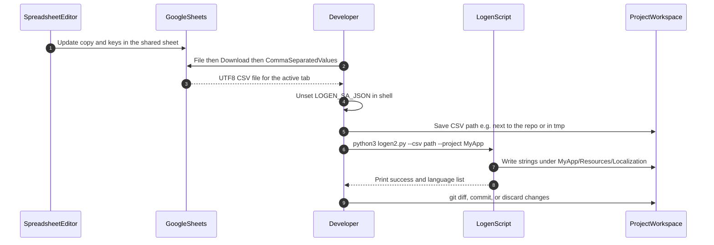
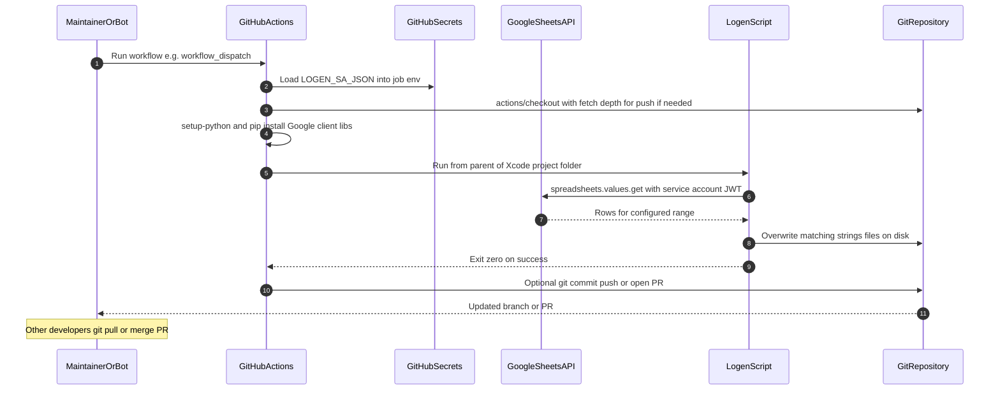

# LOGEN (**Lo**calization **Gen**erator)

Version
[Python Version](https://www.python.org/downloads/release/python-390/)
Swift Version
Hotel

---

## Table of contents

- [How Logen fits in your toolchain](#how-logen-fits-in-your-toolchain)
- [Public repository checklist](#public-repository-checklist)
- [End-to-end flows (manual vs remote)](#end-to-end-flows-manual-vs-remote)
- [Integration guide](#integration-guide)
- [GitHub Actions from zero](#github-actions-from-zero)
- [Troubleshooting](#troubleshooting)
- [Google Cloud and Sheets access](#google-cloud-and-sheets-access)
- [CLI reference](#cli-reference)
- [How to set up (Python and Xcode)](#how-to-set-up)
- [How to use (spreadsheet rules)](#how-to-use)
- [Code reference](#code)

---

## How Logen fits in your toolchain

Logen is a **Python** script (`logen2.py`) that you **add to your app project yourself**—for example by **cloning or downloading this repository** into a folder inside your app repo, or by adding it as a **git submodule**. It is **not** integrated via Swift Package Manager (SPM). The script reads your localization matrix (from **Google Sheets** in CI, or from a **CSV export** on a developer machine) and writes `**.strings`** and `**.stringsdict**` files into your app’s existing `**{Project}.lproj**` folder structure.

Design goals:

- **No per-developer Google OAuth** — nobody stores OAuth client JSON or refresh tokens on laptops for Logen.
- **CI-friendly secrets** — production reads use a **service account** JSON in the environment as `**LOGEN_SA_JSON`** (paste the full key JSON; GitHub Actions supports multiline secrets).
- **Offline / ad-hoc local runs** — use `**--csv`** after downloading the sheet as CSV from the browser.

---

## Public repository checklist

Complete this **before** changing the Logen repo (or any clone that ever held keys) to **public**:

1. **Rotate and revoke** any Google **OAuth client secrets** or **service account keys** that ever appeared in a commit—even if later deleted from the tip of a branch. Public repos expose **full git history**.
2. Remove committed key files from history if required by your security policy (e.g. `git filter-repo`); rotating keys in GCP is mandatory regardless.
3. Confirm `**credentials.json`** and similar are **not** in the default branch and are listed in `[.gitignore](.gitignore)`.
4. After the repo is public, app workflows can `**actions/checkout`** Logen **without** a PAT; private Logen still needs a `**token:`** on that checkout step.

---

## End-to-end flows (manual vs remote)

### Manual flow (CSV on a developer machine)

Use this when you want to iterate quickly without wiring CI, or when you cannot use the service account locally. You must **not** have `**LOGEN_SA_JSON`** set while using `**--csv**`, or Logen will exit with an error.




**Important:** Run `logen2.py` with the **current working directory** set to the parent of your **Xcode project folder** (the folder whose name matches `**--project`**). The script builds paths as `/{project}/{localization_path}/{lang}.lproj/...` from `cwd`.

### Remote flow (GitHub Actions and service account)

Use this as the **team default**: one secret, reproducible runs, and developers **pull** updated strings. The diagram assumes `**workflow_dispatch`** (or a similar guarded trigger); adjust names to your repo.




---

## Integration guide


### 1. Add Logen to your app project (choose one)

Logen is **not** distributed as an SPM dependency. Pick how the **app** repo (and CI) get `**logen2.py`**.

**Option C — CI-only dual checkout (recommended)**  

Keep **no** Logen files in the app source tree by default. In GitHub Actions, `**actions/checkout`** the app repo, then optionally `**actions/checkout**` this **public** Logen repo into `**_logen/`**, run `**python3**` on `**_logen/Logen/logen2.py**` or on a **project-local script** (same CLI; set repo variable `**LOGEN_SCRIPT_PATH**`), and commit only localization outputs.

- Copy the ready-made workflow from `**[examples/ci-dual-checkout/](examples/ci-dual-checkout/README.md)**` into your app repo (see that folder’s `**README.md**` and `**regenerate-localizations.yml**`).
- Add `**_logen/**` to your app’s `**.gitignore**` using the snippet in `**examples/ci-dual-checkout/APP_REPO_DOTGITIGNORE**` so the second checkout is never committed.
- See **[Public repository checklist](#public-repository-checklist)** before publishing Logen.

**Option A — Vendored folder**  

1. Clone or download this repository.
2. Copy at least `**logen2.py`** into your app repo (e.g. `**Scripts/logen2.py**`).
3. Commit; refresh the file when Logen updates.

**Option B — Git submodule**  

```bash
git submodule add https://github.com/YourOrg/Logen.git Vendor/Logen
git submodule update --init --recursive
```

The script path is typically `**Vendor/Logen/Logen/logen2.py**`. In CI, use `**actions/checkout**` with `**submodules: true**`.

Use one stable path in any **Run Script** phases and in `**python3 …`** commands.

### 2. Align spreadsheet layout with the app

Follow [How to use → Spreadsheet setup](#spreadsheet-setup): include a column whose header contains `**iOS**`, and use **two-letter** language codes for locale columns. Keep **one tab per run** (or run Logen multiple times with different `**--sheet`** values if you split locales across tabs).

### 3. Prepare localization folders in Xcode

For each language you generate, the script expects an existing path:

```text
<ParentOfXcodeProject>/<ProjectName>/<LocalizationPath>/<xx>.lproj/
```

Default `**LocalizationPath**` is `**Resources/Localization**`. Example:

```text
MyAppRepo/
  MyApp/                          ← --project MyApp
    Resources/
      Localization/
        en.lproj/
          Localizable.strings
        sk.lproj/
          Localizable.strings
```

Create missing `**.lproj**` folders in Xcode (add empty `Localizable.strings` if needed) before the first run so `**prepare_path**` can resolve targets.

### 4. Choose a run mode


| Mode           | When to use                  | Data source                        | Env vars                                               |
| -------------- | ---------------------------- | ---------------------------------- | ------------------------------------------------------ |
| **CSV**        | Local only, no SA on machine | `--csv /path`                      | `**LOGEN_SA_JSON` must be unset**                      |
| **Sheets API** | CI or trusted runner         | `--id`, `--sheet`, `--last_column` | `**LOGEN_SA_JSON`** (full service account JSON string) |


You cannot combine `**--csv**` with `**LOGEN_SA_JSON**` in the same invocation.

### 5. GitHub Actions (recommended remote integration)

Complete [Google Cloud and Sheets access](#google-cloud-and-sheets-access) first, then follow **[GitHub Actions from zero](#github-actions-from-zero)** below. The **canonical workflow file** for the recommended **dual checkout** setup lives in `**[examples/ci-dual-checkout/regenerate-localizations.yml](examples/ci-dual-checkout/regenerate-localizations.yml)`**—copy it into your app repo and edit `**repository:**`, `**ref:**`, and Logen CLI arguments.


#### GitHub Actions from zero

**What this is:** A *workflow* is a YAML file in your repo that tells GitHub’s servers to run commands when something happens (here: when **you** click **Run workflow**). You do **not** install anything on your laptop for the job itself—GitHub runs it in a temporary virtual machine.

**What you need:** A GitHub repo with your **app source code**, permission to change **Settings**, and permission to **push** to the branch the workflow will update (often `main`).

---

##### Step 1 — Make sure `logen2.py` exists on the runner

**“How does GitHub Actions get `logen2.py`?”**  
The workflow only sees what `**actions/checkout`** brings into the job workspace.


| Approach                           | Best for                                         | Idea                                                                                                                                                     |
| ---------------------------------- | ------------------------------------------------ | -------------------------------------------------------------------------------------------------------------------------------------------------------- |
| **C. Dual checkout (recommended)** | No Logen files in the app repo by default; **public** Logen | Second `**actions/checkout`** of this repo into `**_logen/**` when using the bundled script, then `**python3**` on that script or on a **local path** via `**LOGEN_SCRIPT_PATH**` (same CLI). Add `**_logen/**` to the app `**.gitignore**` when the second checkout is used. |
| **A. Vendored script**             | Simplest disk layout                             | `**Scripts/logen2.py`** (or similar) committed in the app repo.                                                                                          |
| **B. Git submodule**               | Logen pinned as a submodule                      | Submodule + `**submodules: true`** on the app checkout.                                                                                                  |


The **Step 4** template below follows **Option C**. For **A** or **B**, change the `**python3`** path (and remove the second checkout when using **A** only).

---

##### Step 2 — Add the Google secret (click path)

1. On GitHub, open your **app** repository (not necessarily the Logen package repo).
2. Click **Settings** (top bar of the repo).
3. In the left sidebar, open **Secrets and variables** → **Actions**.
4. Click **New repository secret**.
5. **Name:** type exactly: `LOGEN_SA_JSON` (all caps, underscores as shown).
6. **Secret:** open the service account `**.json`** file from Google in a text editor, **Select All**, **Copy**, **Paste** into the secret field. It can be multiple lines—that is OK.
7. Click **Add secret**.

You will **not** see the secret again after saving (GitHub only shows “Updated”). To change it, delete the secret and create a new one, or use **Update**.

---

##### Step 3 — Create the workflow file in git

A workflow file must live under `**.github/workflows/`** and end in `**.yml**` or `**.yaml**`.

1. On your **computer**, open your **app** repo clone in an editor (or use GitHub’s **Add file → Create new file** in the browser).
2. Create folders `**.github`** then `**workflows**` if they do not exist.
3. Create a new file, for example: `**.github/workflows/regenerate-localizations.yml**`
4. Copy from `**[examples/ci-dual-checkout/regenerate-localizations.yml](examples/ci-dual-checkout/regenerate-localizations.yml)**` or paste the **Step 4** template below. Replace `**OWNER/Logen`**, `**ref:**`, spreadsheet args, `**CoffeeShop**`, and `**git add**` paths.
5. **Commit** to `**main`** (or your default branch) and **push**.

Until this file exists on the default branch, the workflow may not appear under the **Actions** tab for `workflow_dispatch`.

---

##### Step 4 — Workflow file template (dual checkout / Option C)

Uses a **second checkout** of this (Logen) repo into `**_logen/`** when you run the upstream script (default). Optionally use a **project-local script** (same CLI as `logen2.py`) via the repo variable `**LOGEN_SCRIPT_PATH**` — the template then **skips** the Logen checkout. **Add `_logen/` to your app `.gitignore`** when you use `_logen/` (see `[examples/ci-dual-checkout/APP_REPO_DOTGITIGNORE](examples/ci-dual-checkout/APP_REPO_DOTGITIGNORE)`). Replace `**OWNER/Logen**`, `**ref:**`, `**--project**`, sheet args, and `**git add**` paths.

```yaml
# .github/workflows/regenerate-localizations.yml (in your APP repo)

name: Regenerate localizations

on:
  workflow_dispatch:

permissions:
  contents: write

jobs:
  logen:
    runs-on: ubuntu-latest
    steps:
      - name: Check out app repository
        uses: actions/checkout@v4
        with:
          persist-credentials: true

      - name: Check out public Logen
        if: ${{ vars.LOGEN_SCRIPT_PATH == '' || startsWith(vars.LOGEN_SCRIPT_PATH, '_logen/') }}
        uses: actions/checkout@v4
        with:
          repository: GoodRequest/Logen
          path: _logen
          ref: main

      - name: Set up Python
        uses: actions/setup-python@v5
        with:
          python-version: "3.11"

      - name: Install Google API libraries
        run: pip install google-api-python-client google-auth google-auth-httplib2

      - name: Run Logen
        env:
          LOGEN_SA_JSON: ${{ secrets.LOGEN_SA_JSON }}
          LOGEN_SCRIPT_PATH: ${{ vars.LOGEN_SCRIPT_PATH }}
        working-directory: ${{ github.workspace }}
        run: |
          SCRIPT="${LOGEN_SCRIPT_PATH:-_logen/Logen/logen2.py}"
          if [ ! -f "$SCRIPT" ]; then
            echo "error: Logen script not found: $SCRIPT"
            exit 1
          fi
          python3 "$SCRIPT" \
            --id "${{ vars.LOGEN_SHEET_ID }}" \
            --sheet "Strings" \
            --first_row 2 \
            --last_column H \
            --project "CoffeeShop"

      - name: Commit and push if files changed
        run: |
          git config user.name "github-actions[bot]"
          git config user.email "41898282+github-actions[bot]@users.noreply.github.com"
          git add -- "CoffeeShop/Resources/Localization/"
          if git diff --staged --quiet; then
            echo "No localization changes to commit."
          else
            git commit -m "chore: regenerate localizations"
            git push
          fi
```

**Why `working-directory: ${{ github.workspace }}`:** Must be the **parent** of your Xcode project folder so paths like `**./CoffeeShop/Resources/Localization/`** resolve.

**Script path:** Default `**_logen/Logen/logen2.py**` matches this repository’s layout. Set **`LOGEN_SCRIPT_PATH`** (e.g. `**Scripts/logen2.py**`) to run a **fork or wrapper** with the same arguments; paths **not** under `**_logen/**` skip the second checkout. If Logen is **private**, add `**token: ${{ secrets.LOGEN_READ_PAT }}`** (or similar) to the **Check out public Logen** step. For **vendored** (**A**) or **submodule** (**B**) setups, prefer `**LOGEN_SCRIPT_PATH**` or adjust paths as needed.

---

##### Step 5 — Run the workflow by hand

1. On GitHub, open the repo → tab **Actions**.
2. In the **left sidebar**, click the workflow name **Regenerate localizations** (the `name:` from YAML).
3. On the right, click **Run workflow** → leave branch as `**main`** (or your default) → **Run workflow**.
4. A row appears in the list; click it, then click the `**logen`** job to see **logs** line by line.

If something fails, open the red ❌ step and read the last lines—they usually contain Python’s error message.

---

##### Step 6 — If `git push` fails (permissions or branch rules)

- `**Permission denied` / `403`:** The default `**GITHUB_TOKEN`** may not be allowed to push to `**main**`. Fix: **Settings → Actions → General → Workflow permissions** → enable **Read and write permissions**, and allow GitHub Actions to create and approve pull requests if your org policy requires it—or use a **Personal Access Token** stored as another secret and configure `actions/checkout` with `token: ${{ secrets.YOUR_PAT }}`.
- **Branch protection** blocking direct pushes: remove the **Commit and push** step for now and only inspect the generated files from the **workflow artifact**, or switch to a workflow that **opens a pull request** instead of pushing to `main` (search GitHub for `create-pull-request` action examples).

---

##### Optional — Put the sheet ID in a variable instead of YAML

If you do not want the spreadsheet ID in the committed file:

1. **Settings → Secrets and variables → Actions** → tab **Variables** → **New repository variable**.
2. Name e.g. `**LOGEN_SHEET_ID`**, value = the ID from the sheet URL.
3. In YAML, replace the `--id` value with `"${{ vars.LOGEN_SHEET_ID }}"` (note `**vars**`, not `**secrets**`). Example variable value: `1Bx8fJsqTziA7kqBLNzboFsOgDefGhIjKlMnOpQr0123` (still use **your** real id).

---

##### Quick glossary


| Term                        | Meaning                                                                              |
| --------------------------- | ------------------------------------------------------------------------------------ |
| **Workflow**                | The whole YAML file under `.github/workflows/`.                                      |
| **Job**                     | A named block like `logen:`; runs on one machine.                                    |
| **Step**                    | One item under `steps:`; often `run:` shell commands or `uses:` a premade action.    |
| `**workflow_dispatch`**     | Manual trigger only (no automatic runs until you click Run).                         |
| `**secrets.LOGEN_SA_JSON**` | Injects the secret you created in Settings as an environment variable for that step. |


### 6. Optional Xcode Aggregate target (CSV only)

If you want a one-click regenerate **without** secrets in Xcode, add an **Aggregate** target whose **Run Script** only invokes `**--csv`** pointing at a file path (ignored by git or refreshed by the developer). Do **not** embed `**LOGEN_SA_JSON`** in the project file.

### 7. Verification checklist

- Service account email has **Viewer** (or higher) access on the spreadsheet.
- `**--sheet`** matches the **exact tab name** in Google Sheets.
- `**--last_column`** covers all locale columns you need.
- `**--project**` matches the **Xcode project / folder name** under the parent directory used as `cwd`.
- `**LOGEN_SA_JSON`** parses as JSON with `**type**` `**service_account**`.
- CSV export uses the **same tab** you would pass as `**--sheet`** in API mode.


### Troubleshooting


| Symptom                                       | Likely cause                                                   | What to do                                                                                                     |
| --------------------------------------------- | -------------------------------------------------------------- | -------------------------------------------------------------------------------------------------------------- |
| `use either --csv or LOGEN_SA_JSON, not both` | Shell still exports `**LOGEN_SA_JSON**` locally                | `unset LOGEN_SA_JSON` (or a clean subshell) before `**--csv**`.                                                |
| `choose one data source`                      | `**LOGEN_SA_JSON**` not set in Sheets mode                     | In the workflow step, set `env: LOGEN_SA_JSON: ${{ secrets.LOGEN_SA_JSON }}`.                                  |
| `NO DATA FOUND IN RANGE` / empty API result   | Wrong `**--sheet**`, `**--last_column**`, or `**--first_row**` | Open the sheet and confirm tab name and last column letter; widen `**--last_column**`.                         |
| `CSV file not found`                          | Wrong path relative to where you run Python                    | Pass an absolute path or `**cd**` to the directory containing the CSV first.                                   |
| `Localization file not found` warnings        | Missing `**.lproj**` directory on disk                         | Create `**xx.lproj**` folders under `**Resources/Localization**` (or your `**--localization_path**`) in Xcode. |
| `403` or permission errors from Google API    | Sheet not shared with the service account                      | Share the spreadsheet with the SA email from the JSON `**client_email**`.                                      |
| `LOGEN_SA_JSON is not valid JSON`             | Truncated or bad paste in the secret                           | Re-paste the full JSON from the `.json` key file in **GitHub → Settings → Secrets**.                           |


---

## Google Cloud and Sheets access

1. In [Google Cloud Console](https://console.cloud.google.com/), select or create a project.
2. Enable **Google Sheets API** for that project (**APIs & Services → Library**).
3. **IAM & Admin → Service Accounts → Create service account** (dedicated account for Logen is recommended).
4. **Keys → Add key → JSON**; download the key once. **Do not commit** this file.
5. **Share** each Google Sheet with the service account’s email (`**something@...iam.gserviceaccount.com`**) as **Viewer** (read-only matches Logen’s scope).
6. Add the key to GitHub: create a secret `**LOGEN_SA_JSON`** and paste the **full JSON** from the downloaded key file. Never commit the key file to git.

Rotate keys by creating a new key, updating the secret, deleting the old key in GCP, and re-running the workflow.

---

# How to set up

## Python

First of all you need to install `python 3.9` on your machine:

Recommended way of installing python on macOS is via *Homebrew Package Manager*. You can grab Homebrew from the official website:

```
https://brew.sh
```

Use Homebrew to download the latest Python 3 version using the following command:

```
brew install python
```

Check if Python is available and installed correctly. You should see a path to the Python binary in your system.

```
which python3
```

Check if you have `pip` python package manager installed. The path should lead to the same directory as the command above.

```
which pip3
```

---

## Xcode integration

Add Logen **without** Swift Package Manager:

1. If you use **CI-only dual checkout**, you do **not** need `logen2.py` on disk for Xcode—strings arrive via **git pull** after the workflow runs. For **local** runs (optional), follow **[integration guide §1](#integration-add-logen)** so the script exists under your app project (e.g. `**${PROJECT_DIR}/Scripts/logen2.py`**) or via a **submodule** path.
2. Optional: create an **Aggregate** target with a **Run Script** phase that invokes `python3` with `**--csv`** and paths relative to `**${PROJECT_DIR}**`, or run the same command from Terminal.

Xcode does **not** need a Logen entry in `**Package.swift`**; the script is plain Python and is not linked into your app binary.


### Running `logen2.py`

Logen supports **exactly one** data source per run:

1. **CI / API (Google Sheets)** — set `**LOGEN_SA_JSON`** to the full service account **JSON** string (paste as plain text). The service account must have access to the spreadsheet (share the sheet with its client email). Then pass `--id`, `--sheet`, `--last_column`, and `--project` as below. Do not set `**LOGEN_SA_JSON`** when using local CSV mode.
2. **Local (no Google credentials)** — in Google Sheets use **File → Download → Comma-separated values (.csv)** for the correct tab, then run with `**--csv /path/to/export.csv`**. If `**LOGEN_SA_JSON**` is set in your shell, unset it for this run (the script errors if CSV and `**LOGEN_SA_JSON**` are combined).

**Recommended team flow:** regenerate strings in **GitHub Actions** (or another CI) with `**LOGEN_SA_JSON`** as a secret, commit or open a PR, and developers **pull** updated localizations. Avoid putting the service account secret into Xcode **Run Script** phases on every machine.

Optional: you can still add an **Aggregate** target with a **Run Script** phase that only runs `**--csv …`** against a path inside the repo (e.g. a checked-in or ignored export), if you want a one-click local regenerate without API keys.


| Parameters          | Required | Description                                                                                                                                           |
| ------------------- | -------- | ----------------------------------------------------------------------------------------------------------------------------------------------------- |
| --project           | yes      | Project name. Use `"${PROJECT_NAME}"` when invoking from Xcode.                                                                                       |
| --csv               | no*      | Path to a UTF-8 CSV export of the sheet. *Required for local mode (mutually exclusive with `LOGEN_SA_JSON`).                                          |
| --id                | no*      | Spreadsheet ID from the sheet URL (e.g. `https://docs.google.com/spreadsheets/d/ASDFGHJKL/edit`). *Required with Sheets API when `--csv` is not used. |
| --sheet             | no*      | Tab name (bottom of the sheet). *Required with Sheets API when `--csv` is not used.                                                                   |
| --last_column       | no*      | Last column letter with data (e.g. `G`). *Required with Sheets API when `--csv` is not used.                                                          |
| --first_row         | no       | First data row (default `1`).                                                                                                                         |
| --localization_path | no       | Path inside the project directory for output (no leading/trailing slash). Default: `Resources/Localization`.                                          |
| --filename          | no       | Base name for `.strings` / `.stringsdict` files. Default: `Localizable`.                                                                              |


#### Example values (copy-paste style)

These are **illustrative** — replace the spreadsheet `**--id*`* with the real value from **your** sheet URL (same string as in the URL path). The app folder `**CoffeeShop`** must match a real directory under the directory where you run the command.

**Browser URL (illustration):**

```text
https://docs.google.com/spreadsheets/d/1Bx8fJsqTziA7kqBLNzboFsOgDefGhIjKlMnOpQr0123/edit#gid=0
                                      └────────────────────────── spreadsheetId ──────────────────────────┘
```

**Sheets API run in GitHub Actions** (same step as **Secrets** `LOGEN_SA_JSON`; optional repo variable `LOGEN_SCRIPT_PATH` — default `_logen/Logen/logen2.py`):

```yaml
env:
  LOGEN_SA_JSON: ${{ secrets.LOGEN_SA_JSON }}
  LOGEN_SCRIPT_PATH: ${{ vars.LOGEN_SCRIPT_PATH }}
run: |
  SCRIPT="${LOGEN_SCRIPT_PATH:-_logen/Logen/logen2.py}"
  python3 "$SCRIPT" \
    --id "${{ vars.LOGEN_SHEET_ID }}" \
    --sheet "Strings" \
    --first_row 2 \
    --last_column H \
    --project "CoffeeShop"
```

Use a literal `**--id "..."**` instead of `**vars**` if you prefer. Same fragment appears in **Step 4** above.

**Sheets API run locally** (vendored script at `**Scripts/logen2.py`**):

```bash
cd /path/to/parent-of-xcode-project   # e.g. repo root that contains CoffeeShop/
python3 Scripts/logen2.py \
  --id "1Bx8fJsqTziA7kqBLNzboFsOgDefGhIjKlMnOpQr0123" \
  --sheet "Strings" \
  --first_row 2 \
  --last_column H \
  --project "CoffeeShop"
```

- `**--id**` — the segment after `/d/` in the URL (no slashes; Google’s ids are often **44 characters**, as in the example below).
- `**--sheet`** — the **tab name** at the bottom of the spreadsheet (must match exactly, including spaces and case).
- `**--first_row`** — here `**2**` means “data starts on row 2” (row 1 is headers / description rows).
- `**--last_column**` — `**H**` means the range ends at column **H** (so `A`…`H` is read for each row).
- `**--project`** — Xcode project **folder** name under `cwd` (here `**CoffeeShop`**), so outputs go under `**CoffeeShop/Resources/Localization/**`.

**Local CSV run** (no Google env vars set):

```bash
cd /path/to/parent-of-xcode-project
python3 Scripts/logen2.py \
  --csv "./exports/CoffeeShop-Strings-tab.csv" \
  --project "CoffeeShop"
```

Use a CSV exported from the **same tab** you would target with `**--sheet`** in API mode.

Slovak parrot
USA parrot
Deutscher papagei
Spain parrot

# How to use

## Spreadsheet setup

There isn't much to set up in the spreadsheets. They should follow this general formatting:


| Description | 1234 iOS ASDF        | Android      | SK        | EN            |
| ----------- | -------------------- | ------------ | --------- | ------------- |
| Any         | Title of this column | This should  | Preklad 1 | Translation 1 |
| description | should contain       | burn in hell | Preklad 2 | Translation 2 |
| you         | the word "iOS"       |              | Preklad 3 | Translation 3 |
| want        | somewhere            |              | Preklad 4 | ...           |


It's important to note that the language column should be exactly 2 letters long and reflect the same language code that's used in the project.

## Localizations with parameter

### Valid parameters

[String Format Specifiers](https://developer.apple.com/library/archive/documentation/Cocoa/Conceptual/Strings/Articles/formatSpecifiers.html)

### Examples

## Pluralized localizations

To inform Logen that this localization should be treated as pluralized you will need to include (pluralized) tag somewhere in localization id. Example: ios.pluralized_string(pluralized)

### Plularized tags options

[Localizing strings that contain plurals | Apple Developer Documentation](https://developer.apple.com/documentation/xcode/localizing-strings-that-contain-plurals)

### Examples


| Location | Identifier iOS                                               | CS                                             |
| -------- | ------------------------------------------------------------ | ---------------------------------------------- |
|          | test.pluralized.normalString                                 | %s string                                      |
|          | test.pluralized.pluralString(pluralized)                     | %1$ddendnídnů                                  |
|          | test.pluralized.multiplePluralString(pluralized)             | %1$@ GB, %2$@. zóna, zbývá %3$ddendnídnů       |
|          | test.pluralized.multipleMorePluralString(pluralized)         | %1$ddendnídnů, %2$@. zóna, zbývá %3$ddendnídnů |
|          | test.pluralized.multiplePluralTagOnly(pluralized)            | %@ GB, %@. zóna, zbývá %ddendnídnů             |
|          | test.pluralized.multiplePluralStringReverseOrder(pluralized) | %1$@ GB, %2$@. zóna, zbývá %3$ddendnídnů       |


## Other Localized files

You can also use Logen to generate different files that you want to be localized. For example InfoPlist.stings, in this case all you need to do is to write Property List Key in Identifier iOS column and mark it with name of the file → in this case (InfoPlist)

### Examples


| Location | Identifier iOS                      | CS                          |
| -------- | ----------------------------------- | --------------------------- |
|          | NSFaceIDUsageDescription(InfoPlist) | NSFaceIDUsageDescription CS |
|          | CFBundleDisplayName(InfoPlist)      | CFBundleDisplayName CS      |


# Code

The source of truth is `[logen2.py](logen2.py)`. This section summarizes behavior; open the file for exact logic.

## Authentication and data loading

- `**LOGEN_SA_JSON**` (environment): full **service account** JSON as a string. Used with `**--id`**, `**--sheet**`, `**--last_column**` to fetch the range via the Sheets API. Google client libraries are imported only on this path (`import_google_sheets_api`, `fetch_spreadsheet_from_sheets`).
- `**--csv**`: loads a UTF-8 CSV (with BOM tolerated) into the same `**list[list[str]]**` shape as the API; no Google packages required (`load_spreadsheet_from_csv`).

`LOCALIZATION_PATH`, `SPREADSHEET_ID`, `RANGE`, and `PROJECT_NAME` are set from CLI args where applicable.

## **Classes**

### `**Translation`**

 Represents a translation with a type and its corresponding value.

```python
class Translation:
    def __init__(self, type, translation):
        self.type = type
        self.translation = translation

    def output(self):
        return """<key>{}</key>
        <string>{}</string>""".format(self.type, self.translation)
```

### `**Variable**`

Represents a variable with a key and a list of translations.

```python
class Variable:
    def __init__(self, key, translations):
        self.key = key
        self.translations = translations

    def string_of_translations(self, translation):
        return translation.output()
    
    def output(self):
        list_of_transalations_strings = map(self.string_of_translations, list(self.translations))
        joined_strings = "\n".join(list_of_transalations_strings)
        return """<key>{}</key>
             <dict>
                 <key>NSStringFormatSpecTypeKey</key>
                 <string>NSStringPluralRuleType</string>
                 <key>NSStringFormatValueTypeKey</key>
                 <string>d</string>
                 {}
             </dict>""".format(self.key, joined_strings)
```

### `**LocalizedString**`

Represents a localized string with a key, a base string, and a list of variables.

```python
class LocalizedString:
    def __init__(self, key, string, variables):
        self.key = key
        self.string = string
        self.variables = variables

    def string_of_variables(self, variables):
        return variables.output()

    def output(self):
        list_of_transalations_strings = map(self.string_of_variables, list(self.variables))
        joined_strings = "\n".join(list_of_transalations_strings)
        value = """<key>{}</key>
         <dict>
             <key>NSStringLocalizedFormatKey</key>
             <string>{}</string>
             {}
         </dict>"""
        return value.format(self.key, self.string, joined_strings)
```

## Functions

CLI and I/O helpers include `**parse_arguments**`, `**validate_and_resolve_mode**`, `**load_spreadsheet**`, `**import_google_sheets_api**`, `**pip_install_google_apis**`, `**fetch_spreadsheet_from_sheets**`, and `**load_spreadsheet_from_csv**`. See `[logen2.py](logen2.py)`.

### `**get_languages(spreadsheet)**`

This function extracts language headers from the spreadsheet.

- **Parameters:**
  - `**spreadsheet`** (list of lists): The data retrieved from the spreadsheet.
- **Returns:**
  - List of language headers.

```python
def get_languages(spreadsheet):
    headers = spreadsheet[0]
    languages = []
    for header in headers:
        if len(header) == 2:
            languages.append(header)

    return languages
```

### `**generate_strings(spreadsheet, language)**`

Generates localized strings for the specified language based on the spreadsheet data.

- **Parameters:**
  - `**spreadsheet`** (list of lists): The data retrieved from the spreadsheet.
  - `**language**` (str): The language for which to generate localized strings.
- **Returns:**
  - Tuple containing a list of simple localized strings and a list of pluralized localized strings.

```python
def generate_strings(spreadsheet, language):
    ios_column_name = "iOS"
    ios_column_first_match = [header for header in spreadsheet[0] if ios_column_name in header][0]
    ios_column_index = spreadsheet[0].index(ios_column_first_match)

    language_column_index = spreadsheet[0].index(language)

    list_of_strings = []
    pluralized_rows = []

    for row in spreadsheet:
        try:
            if not row[ios_column_index]:
                continue
            else:
                key = row[ios_column_index]
                if "(pluralized)" in key:
                    pluralized_rows.append(row)

                translation = fix_special_substrings(row[language_column_index])
                localized_entry = as_localized_entry(key, translation)
                list_of_strings.append(localized_entry)

        except IndexError:
            continue

    pluralized_strings = create_pluralized_file(pluralized_rows, language_column_index, ios_column_index)
    return list_of_strings, pluralized_strings
```

### `**generate_special_strings(spreadsheet, language)**`

Generates localized strings for the specified language based on the spreadsheet data.

- **Parameters:**
  - `**spreadsheet`** (list of lists): The data retrieved from the spreadsheet.
  - `**language**` (str): The language for which to generate localized strings.
- **Returns:**
  - Dictionary containing a file_name as key and a list of simple localized strings as values

```python
def generate_special_strings(spreadsheet, language):
    ios_column_name = "iOS"
    ios_column_first_match = [header for header in spreadsheet[0] if ios_column_name in header][0]
    ios_column_index = spreadsheet[0].index(ios_column_first_match)

    language_column_index = spreadsheet[0].index(language)

    dict_of_special_strings = dict()

    for row in spreadsheet:
        try:
            if not row[ios_column_index]:
                continue
            else:
                key = row[ios_column_index]
                if "(" in key and "(pluralized)" not in key:
                    file_name = key[key.find("(") + 1:key.find(")")]
                    translation = fix_special_substrings(row[language_column_index])
                    localized_entry = as_special_localized_entry(key, file_name, translation)

                    if file_name in dict_of_special_strings:
                        dict_of_special_strings.get(file_name).append(localized_entry)
                    else:
                        dict_of_special_strings.update({file_name : [localized_entry]})

        except IndexError:
            continue

    return dict_of_special_strings
```

### `**create_pluralized_file(rows, language_index, ios_column_index)**`

Creates localized strings for pluralized entries based on the provided rows.

- **Parameters:**
  - `**rows`** (list of lists): Rows containing pluralized entries.
  - `**language_index**` (int): Index of the language column.
  - `**ios_column_index**` (int): Index of the iOS column.
- **Returns:**
  - List of `**LocalizedString`** objects representing pluralized entries.

```python
def create_pluralized_file(rows, language_index, ios_column_index):
    localized_strings = []
    key = ""
    for row in rows:
        localized_string = ""
        variables = []
        key = row[ios_column_index]
        for index, variable in enumerate(separate_strings(row[language_index])):
            if "%" in variable:
                localized_string = localized_string + "%#@variable{}@".format(index)
                variables.append(Variable("variable{}".format(index), extract_pluralized_translations(variable)))
            else:
                localized_string = localized_string + variable
        localized_strings.append(LocalizedString(key.replace("(pluralized)", ""), localized_string, variables))
    return localized_strings
```

### `**separate_strings(input_string)**`

Splits a string into segments based on specified patterns.

- **Parameters:**
  - `**input_string`** (str): The input string to be split.
- **Returns:**
  - List of string segments.

```python
def separate_strings(input_string):
    # Define a regular expression pattern to capture substrings around '%[0-9]+\$@'
    pattern = r'([^%]*)(%[0-9]*\$*[@dDuUxXoOfeEgGcCsSpaAF][^%]*)'

    # Use re.split to split the input string around the specified pattern
    result = re.split(pattern, input_string)

    # Remove empty strings from the result
    result = [segment for segment in result if segment]

    return result
```

### `**extract_pluralized_translations(input_string)**`

Extracts translations from a pluralized string.

- **Parameters:**
  - `**input_string`** (str): Pluralized input string.
- **Returns:**
  - List of `**Translation`** objects representing pluralized translations.

```python
def extract_pluralized_translations(input_string):
    translations = []

    # Continue loop as long as there are pairs of tags
    while "<" in input_string and ">" in input_string:
        # Find the opening tag
        start_index = input_string.find("<")
        # Find the closing tag
        end_index = input_string.find(">")

        if start_index != -1 and end_index != -1:
            # Extract the tag content
            tag = input_string[start_index + 1:end_index]

            # Check if the tag is a valid pluralization tag
            if tag in ["one", "two", "few", "many", "other", "zero"]:
                # Find the opening tag of the translation content
                translation_start = input_string.find("<{}>".format(tag))
                # Find the closing tag of the translation content
                translation_end = input_string.find("</{}>".format(tag))

                if translation_start != -1 and translation_end != -1:
                    # Extract the translation content
                    translation = input_string[:start_index] + input_string[translation_start + len(tag) + 2:translation_end]

                    # Append the translation to the list
                    translations.append(Translation(tag, translation))

                    # Modify input_string to remove the current translation tag pair
                    input_string = input_string[:start_index] + input_string[translation_end + len(tag) + 3:]

    if not translations:
        # Default to 'other' if no specific pluralization tag is found
        translations.append(Translation("other", input_string))

    return translations
```

### `**fix_special_substrings(string)**`

Handles special substrings and escapes in a string.

- **Parameters:**
  - `**string`** (str): The input string to be processed.
- **Returns:**
  - Processed string.

```python
def fix_special_substrings(string):
    s_substring = "%s"
    s_substring_replacement = "%@"

    quote_substring = '"'
    quote_substring_replacement = '\\"'

    if re.search(quote_substring, string):
        string = string.replace(
            quote_substring,
            quote_substring_replacement,
            string.count(quote_substring)
        )

    if re.search(s_substring, string):
        string = string.replace(
            s_substring,
            s_substring_replacement,
            string.count(s_substring)
        )

    string = html.unescape(string)

    return string
```

### `**as_localized_entry(key, translation)**`

Formats a localized entry for output.

- **Parameters:**
  - `**key`** (str): The key for the localized entry.
  - `**translation**` (str): The translation for the localized entry.
- **Returns:**
  - Formatted string representing the localized entry.

```python
def as_localized_entry(key, translation):
    return "\"{}\" = \"{}\";".format(key.replace("(pluralized)", ""), translation)
```

### `**as_special_localized_entry(key, file_name, translation)**`

Formats a localized entry for output.

- **Parameters:**
  - `**key`** (str): The key for the localized entry.
  - `**file_name**` (str): The name for the localized file.
  - `**translation**` (str): The translation for the localized entry.
- **Returns:**
  - Formatted string representing the localized entry.

```python
def as_special_localized_entry(key, file_name, translation):
    return "{} = \"{}\";".format(key.replace("({})".format(file_name), ""), translation)
```

### `**save_strings(strings, language)**`

Saves generated strings to a file.

- **Parameters:**
  - `**strings`** (list of str): List of simple localized strings.
  - `**language**` (str): The language for which to save the strings.

```python
def save_strings(strings, language):
    file_path = prepare_path(language, False)
    if file_path:
        with open(file_path, "w") as output_file:
            output_file.write("/*\n * Generated by Logen v2\n")
            output_file.write(" */\n\n")

            for line in strings:
                output_file.write(line)
                output_file.write("\n")

    else:
        print("⚠️ Localization file not found - {} ⚠️".format(language))
```

### `**save_pluralized_strings(strings, language)**`

Saves generated pluralized strings to a file.

- **Parameters:**
  - `**strings`** (list of `**LocalizedString**`): List of pluralized localized strings.
  - `**language**` (str): The language for which to save the pluralized strings.

```python
def save_pluralized_strings(strings, language):
    file_path = prepare_path(language, True)
    mapped_values = map(lambda value: value.output(), list(strings))
    output = """<?xml version="1.0" encoding="UTF-8"?>
    <!DOCTYPE plist PUBLIC "-//Apple//DTD PLIST 1.0//EN" "http://www.apple.com/DTDs/PropertyList-1.0.dtd">
    <plist version="1.0">
    <dict>
    {}
    </dict>
    </plist>""".format("\n".join(mapped_values))

    if file_path:
        with open(file_path, "w+") as output_file:
            output_file.write(output)

    else:
        print("⚠️ Output language file not found - {} ⚠️".format(language))
```

### `**save_special_strings(strings, language)**`

Saves generated strings to a file.

- **Parameters:**
  - `**strings`** (list of str): Dictionary of files and localized strings.
  - `**language**` (str): The language for which to save the strings.

```python
def save_special_strings(strings, language):
    for file_name in strings: 
        file_path = prepare_path(language, False, file_name)
        if file_path:
            with open(file_path, "w") as output_file:
                output_file.write("/*\n * Generated by Logen v2\n")
                output_file.write(" */\n\n")

                for line in strings.get(file_name):
                    output_file.write(line)
                    output_file.write("\n")

        else:
            print("⚠️ Localization file not found - {} ⚠️".format(language))
```

### `**prepare_path(language, isPluralizedFile, fileName)**`

Prepares the path for saving localization files (uses global `**FILENAME**` / per-file name for special strings).

- **Parameters:**
  - `**language`** (str): The language for which to prepare the path.
  - `**isPluralizedFile**` (bool): Whether the file is `.stringsdict`.
  - `**fileName**` (str): Base name (`Localizable`, `InfoPlist`, etc.).
- **Returns:**
  - Absolute path if the `.lproj` directory exists, else `**None`**.

See `[logen2.py](logen2.py)` for the implementation.

### `**print_success_message(languages)**`

Prints a success message with the generated languages.

- **Parameters:**
  - `**languages`** (list of str): List of languages for which strings were generated.

```python
def print_success_message(languages):
    print("✅ Generated strings for {} language(s):".format(len(languages)))
    for language in languages:
        print("    - {}".format(language))
```

### `**parse_arguments()**`

Parses CLI args; `**--id` / `--sheet` / `--last_column**` are required only when not using `**--csv**`. See `[logen2.py](logen2.py)` for the full implementation (including `**--filename**` and `**validate_and_resolve_mode**` after parse).