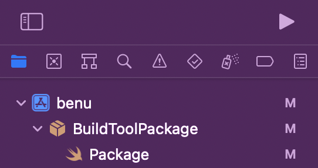

# What is a Swift Build Tools package?

Swift Build Tools package is a way to add build tools to your Xcode project via SwiftPM.

### Why not add packages as a standard dependency?
Separate build tools package has one big advantage. That is, these packages do not get embedded into the final project, and are only there while you build your project. You most probably don't want to pack codestyle linters and localization generators within your application that's publicly available on the App Store.

### How do I create such package?
First you need to create an empty Swift package. Open terminal in your project directory (pro tip: if you're using Fork, press *Cmd+Ctrl+T*) and type:
```
mkdir BuildToolsPackage
cd BuildToolsPackage
touch Package.swift
```
Any directory with `Package.swift` file is considered by Xcode as being a package. You now have to add this package to your project. Drag the `BuildToolsPackage` directory you just created and drop it into Xcode on the uppermost level, here:



You should see Xcode recognizing the directory as a package and changing the icon accordingly. Now, open the `Package` file in Xcode and create a package definition:

```
// swift-tools-version:5.5

import PackageDescription

let package = Package(
    name: "BuildToolPackage",
    dependencies: [
      // ...
    ]
)

```

Check that the package is **not** added as a build dependency:
- Open project settings
- Select your App target from the left column (usually the one with your app's icon)
- Open General tab and check section "Frameworks, Libraries and Embedded Content"
- Open Build Phases tab and check sections "Dependencies" and "Link Binary with Libraries"

Inside the `dependencies` argument in `Package.swift` you can now add packages you want available only during compile time and don't want to ship with your app.
